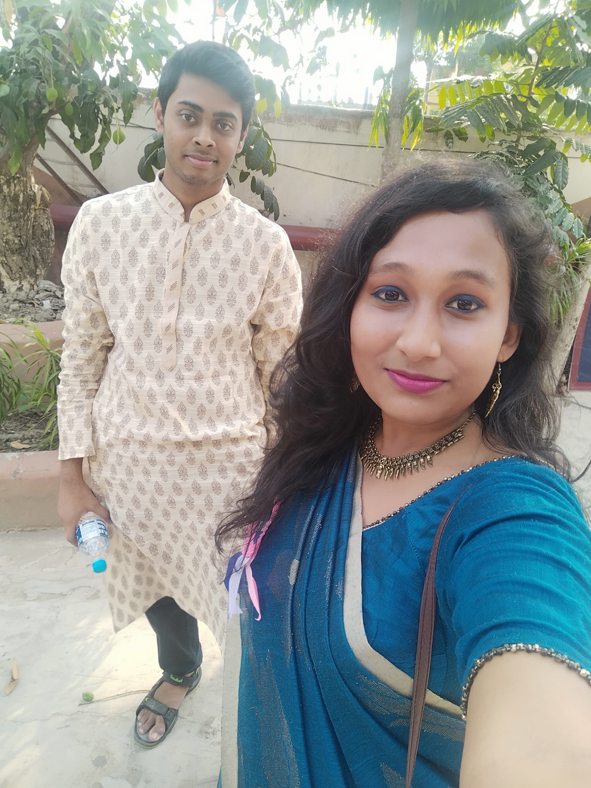

<html>
    <head><link rel="stylesheet" href="oo.css">
        <title>Ayusmita's first html</title>
    </head>
    <body>
       <h1 style="color:chocolate"> <marquee behaviour="scroll" direction="left">I'm Teaching Ayusmita</marquee></h1>

  <h1 style="color:rgb(143, 20, 143)">She has a cute angelic smile</h1>
        <h1 style="color:cornsilk"> Dil ye mera Dance kare, when she is talking to me </h1>
        <h3 style="color:darkseagreen">you can't miss her voice from even a crowd million people</h3>
        
ওই তুই আমাকে ভুল বুঝিসনা  দয়া করে। আসলে আমি তোর সম্পর্কে কিছু না জেনেই  তোকে কথাগুলো বলে ফেললাম। তুই ও হয়তো অন্য কাউকে ভালোবাসিস বা হয়তো আমার মতোই অন্য কাউকে পছন্দ করিস বা এইসব একেবারে পছন্দ করিসনা। 
        

  
আমি আসলে এই কথা গুলো কোনোদিন ই তোকে বলতাম না। কিন্তু পরে ভাবলাম পুরো life টা suffer করতে হবে যে একজন কে ভালোবেসে বলতে পারলাম না। আপনি আমার ভগবান ম্যাম । আপনিও তো একজন Doctor আমার দিক থেকেও একবার ভেবে দেখুন please!!! 
             সবশেষে একটাই কথা বলব   ম্যাম মন থেকে ভালোবাসি আপনাকে আর সারাজীবন বাসব ❤️
            

            <a href="Hyperlink.html">Click me</a>  
              
            <h2 style="color:deeppink">This fossile smile and us</h2>
            <iframe src="https://www.google.com/maps/embed?pb=!1m18!1m12!1m3!1d1215.5688381305806!2d88.36418569594947!3d22.59052214113916!2m3!1f0!2f0!3f0!3m2!1i1024!2i768!4f13.1!3m3!1m2!1s0x3a02763485b31221%3A0x507df2714e560cf7!2sGirish%20Park%2C%20Kolkata%2C%20West%20Bengal!5e1!3m2!1sen!2sin!4v1619691425402!5m2!1sen!2sin" width="400" height="400" style="border:0;" allowfullscreen="" loading="lazy"></iframe>
         
            <iframe width="560" height="400" src="https://www.youtube.com/embed/D-iZxyhJLiY" title="YouTube video player" frameborder="0" allow="accelerometer; autoplay; clipboard-write; encrypted-media; gyroscope; picture-in-picture" allowfullscreen></iframe>
